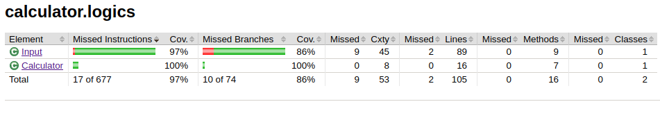

**Yksikkötestaus**

Sovelluksen yksikkötestit koostuvat pakkauksen calculator.logics luokkien Calculator ja Input testeistä.
Alla kuva näiden testien rivi- ja haarautumakattavuudesta.

Testit eivät käy läpi aivan kaikkia mahdollisia tilanteita, sillä koodiin jäi valitettavasti jonkin verran toistoa, ja osa näistä samankaltaisista tilanteista on jo testattu.

**Sovellukseen jääneet laatuongelmat**

Sovelluksessa ei ole huomioitu kunnolla vääränlaisia syötteitä. Syötteistä, joiden ensimmäinen merkki on * tai /, annetaan huomautus "Virheellinen syöte" laskimen alareunassa. Kuitenkaan esimerkiksi muotoa "1+/2" olevaan syötteeseen ei ole varauduttu mitenkään.
